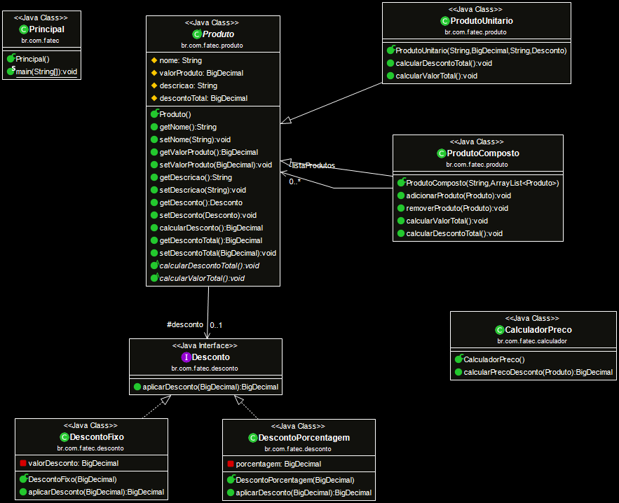

# DesignPatternsJava
Estudo sobre o design pattern Strategy usando Java, atividades para praticar da Fatec Jessen Vidal

O exercício proposto se encontra [nesse link](III.pdf).

### Diagrama de classes
Clique na imagem para melhor visualização
